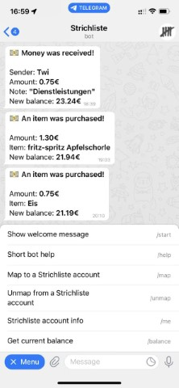

# strichliste-telegram - A Strichliste Telegram Bot
A Telegram Bot written in Python for the great [Strichliste](https://github.com/strichliste) project. The *Strichliste Telegram Bridge* runs well as systemd daemon or inside a docker container like [strichliste-docker](https://github.com/Westwoodlabs/strichliste-docker) we also build.

## Screenshot

[](.github/demo.jpg)

## Usage
- Get bot token form Telegram Bot Father
- Rename config.default.py to config.py and change parameters
- Start script ./bot.py
## systemd-Deamon

See [sltgbridge.service](sltgbridge.service)
```
[Unit]
Description=Strichliste Telegram Bridge
After=syslog.target
After=network.target

[Service]
Type=simple
User=sltgbridge
Group=sltgbridge
WorkingDirectory=/opt/StrichlisteTelegramBridge
ExecStart=/opt/StrichlisteTelegramBridge/SlTgBridge.py
SyslogIdentifier=sltgbridge
StandardOutput=syslog
StandardError=syslog
Restart=always
RestartSec=3

[Install]
WantedBy=multi-user.target

```